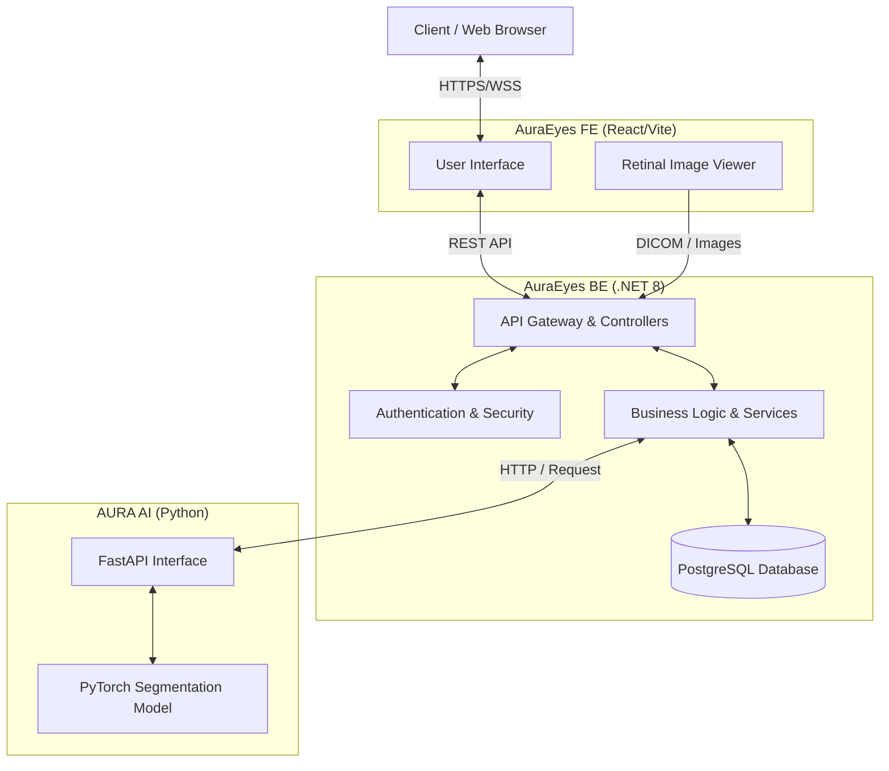

### AI Understanding Retinal Analysis 👁️

    
    
    

    
    
    
    

---

## Roadmap (Lộ trình phát triển)

| Phase | Duration | Focus Area |
| --- | --- | --- |
| **1: Kickoff & Specifications** | 01/01 - 15/01/2026 | Project Scope, Architecture Design, Workflow Definition |
| **2: Core Build** | 16/01 - 15/03/2026 | API Development, UI/UX Implementation, AI Model Initialization |
| **3: Integration** | 16/03 - 15/04/2026 | AI-Assisted Diagnosis Integration, End-to-End Testing |
| **4: Finalization** | 16/04 - 30/04/2026 | Performance Audit, Documentation, Release Polishing |

---

## What It Does (Giới thiệu dự án)

**AURA Eyes** is a state-of-the-art retinal vascular screening platform designed to empower clinical reviews through AI. The system streamlines medical workflows, enabling teams to transition from image capture to diagnostic decisions with unprecedented efficiency.

The system is engineered to achieve three primary outcomes:
- **Accelerate** retinal screening through high-precision AI-assisted analysis.
- **Optimize** interactions between Patients, Clinics, and Ophthalmologists.
- **Ensure** medical workflows remain auditable, secure, and strictly role-based.

---

## Key Capabilities (Tính năng cốt lõi)

### Clinical Screening (Sàng lọc lâm sàng)
- **Retinal Image Upload:** Support for high-resolution medical imaging review.
- **AI-Assisted Diagnostics:** Generation of Heatmaps and explanatory results for rapid screening.
- **Professional Validation:** Final diagnosis confirmation and adjustment by certified Ophthalmologists.

### Patient Journey (Trải nghiệm bệnh nhân)
- **Secure Access:** Authentication via OTP and Google OAuth 2.0.
- **Seamless Booking:** Direct appointment scheduling and consultation requests.
- **Health Tracking:** Real-time screening results tracking and post-diagnosis support.

### Professional Workflow (Quy trình chuyên gia)
- **Credential Verification:** Strict validation of Ophthalmologist medical licenses.
- **Case Management:** Efficient dashboard for availability control and clinical case review.
- **Tele-Consultation:** Secure real-time chat and collaboration tools for diagnostic flows.

### Admin & Organizational Control (Quản trị hệ thống)
- **Institutional Management:** Approval and activation of Clinic/Hospital accounts.
- **Financial Oversight:** Billing automation, revenue sharing, and operational reporting.

---

## Repository Map (Danh mục Repository)

### Backend Services ([AuraEyes_BE](https://github.com/AuraEyesOrg/AuraEyes_BE))

      

The Core API manages business logic, Role-Based Access Control (RBAC), clinic integrations, and scheduling. Built with **Clean Architecture** for maximum scalability and security.

### Frontend Portal ([AuraEyes_FE](https://github.com/AuraEyesOrg/AuraEyes_FE))
           

The User Interface platform provides a specialized dashboard for Ophthalmologists and a responsive portal for Patients, featuring a high-performance **Retinal Imaging Viewer**.

### [AI Engine (AURA_AI)](https://github.com/AuraEyesOrg/AURA_AI)
  

Handles Machine Learning workloads, including **Retinal Vessel Segmentation**, anomaly detection, and diagnostic Heatmap generation to accelerate clinical review.

---

## System Flow (Kiến trúc hệ thống)

---

## Demo Video (Trải nghiệm tính năng)

<video width="100%" controls>
  <source src="https://github.com/user-attachments/assets/4fac4b26-d89d-4199-920f-80e81fc7467b" type="video/mp4">
  Trình duyệt của bạn không hỗ trợ thẻ video.
</video>
 
<em>(Video Demo - Trải nghiệm các tính năng cốt lõi của AURA Eyes)</em>

---

## Team (Đội ngũ dự án)

### Supervisors (Giảng viên hướng dẫn)
| Role | Name |
| --- | --- |
| **Main Supervisor** | Nguyễn Văn Chiến |
| **Co-Supervisor** | Trương Hoàng Vinh |

### Students (Sinh viên thực hiện)

<table align="center">
  <tr>
    <td align="center" width="25%">
       
      <b>Hoàng Quốc An</b> Leader 
      <a href="mailto:anhqse181520@fpt.edu.vn">anhqse181520@fpt.edu.vn</a>
    </td>
    <td align="center" width="25%">
       
      <b>Trần Đình Thịnh</b> Member 
      <a href="mailto:thinhtdse181531@fpt.edu.vn">thinhtdse181531@fpt.edu.vn</a>
    </td>
    <td align="center" width="25%">
       
      <b>Đào Công An Phước</b> Member 
      <a href="mailto:phuocdcase180581@fpt.edu.vn">phuocdcase180581@fpt.edu.vn</a>
    </td>
    <td align="center" width="25%">
       
      <b>Nguyễn Việt</b> Member 
      <a href="mailto:vietnse180672@fpt.edu.vn">vietnse180672@fpt.edu.vn</a>
    </td>
  </tr>
</table>

---

## Project Identity (Thông tin định danh)

| Item | Value |
| --- | --- |
| **Project Code** | SP26SE025 |
| **Full Name** | System for Retinal Vascular Health Screening |
| **Vietnamese Name** | Hệ Thống Sàng Lọc Sức Khỏe Mạch Máu Võng Mạc |
| **Abbreviation** | AURA Eyes |
| **Duration** | 01/01/2026 - 30/04/2026 |

---

## References
- [Project Registration Form](../../docs/Register.md)
- [Backend Documentation](../../README.md)
- [Frontend Documentation](https://github.com/AuraEyesOrg/AuraEyes_FE/blob/develop/README.md)

Built with ❤️ by <b>AURA Team</b> in HCMC. © 2026

